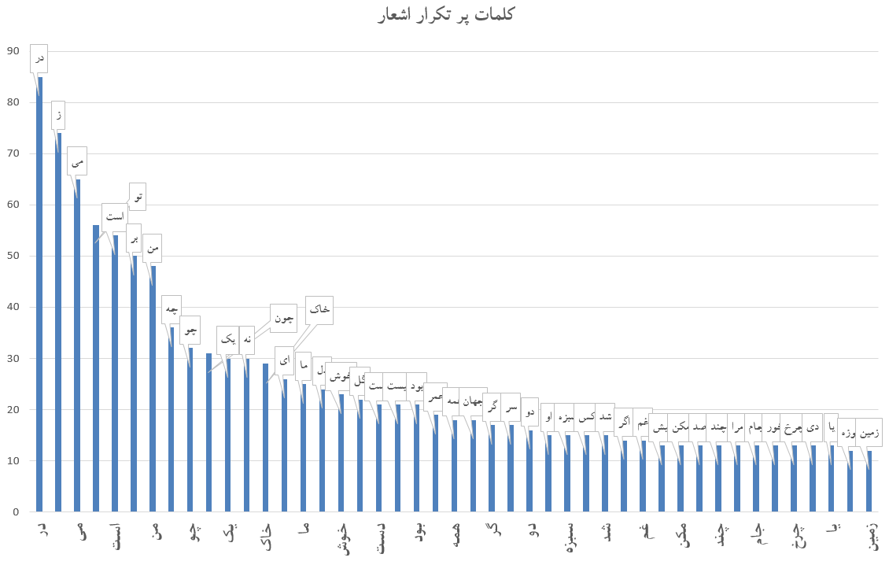

## On Chatbots like Chatgpt works? and how to instruct them - Prompt engineering?


[Hesam Mohammad Hosseini](https://www.linkedin.com/in/hesam-mohammad-hosseini/)

Sep 18, 2023


### Agenda 

- Part 1
   - What is Chatgpt?
       - Review and discuss understandings <!-- of participants -->
	      - How do you think it works?
       - Any case of wrong and unrelated answer you face?
   - Review concepts
   - Theories which works on the back
       - 
   - Algorithm
       - `Page rank`
          - Anyway to crack? <!-- SEO -->
   
- Part 2
   - Guide for better?
   - Known issues
       - Referencing
	   - Math and statistic problem
	   - Programing

### Part 1

- Try to review and explain

- Review and discuss understandings <!-- of participants -->
   - How do you think it works?
   - Any case of wrong and unrelated answer you face?


### Chatbots - 1


- List of highly known chatbots


|Name|URL|
|----|---|
|ChatGPT|https://chat.openai.com/|
|Bard|https://bard.google.com/|
|Claude|https://claude.ai/|
|TheB.AI|https://beta.theb.ai|
|Poe|https://poe.com/|
|YouChat||
|Bing Chat||
|Jasper||
|Chatsonic||
|character.AI||
|Perplexity AI||
|HuggingChat||


<!-- ### What is Chatgpt (Chatbots in general) ?

- What is chatgpt?
   - [what is chatgpt doing and why does it work?](https://writings.stephenwolfram.com/2023/02/what-is-chatgpt-doing-and-why-does-it-work)
   - What is chatgpt?
   - What is chatgpt doing?
   - Why does it work? i.e. How it works?

- Sample of result with issue
   - [the-lone-banana-problem](https://www.digital-science.com/tldr/article/the-lone-banana-problem-or-the-new-programming-speaking-ai/)
 -->
### What is your understanding?

- What is chatgpt?
   - [what is chatgpt doing and why does it work?](https://writings.stephenwolfram.com/2023/02/what-is-chatgpt-doing-and-why-does-it-work)
   - How it works?

- How Google works?
   - `page rank algorithm`


### What is your understanding on `chatbots`?


- What ChatGPT, and chatbots in general, is always fundamentally trying to do?

   > produce a “**reasonable continuation”** of whatever text it’s got so far, 

   - where by **“reasonable”** we mean “what one might expect someone to write after seeing what people have written on billions of webpages, etc.”

   - “The best thing about AI is its ability to”. 
   Imagine scanning billions of pages of human-written text (say on the web and in digitized books) 
   and finding all instances of this text—then seeing what word comes next what fraction of the time. 
   ChatGPT effectively does something like this, except that (as I’ll explain) it doesn’t look at literal text; 
   it looks for things that in a certain sense “match in meaning”. 
   But the end result is that it produces a ranked list of words that might follow, together with “probabilities”:
- ?


### How? not our focus!

- Making required dataset


- Making model


- Getting output


### Wrong but useful!

- Wrong but useful algorithms?


### Till now understood architecture


<!--  -->

<!-- blank line -->
<figure class="figure-center figure-caption">
  
  <figcaption>This is the caption for the figure.</figcaption>
</figure>


### Video

<!-- blank line -->
<figure class="video_container">
  <video controls="true" allowfullscreen="true" >
    <source src="HowAIWorks_LLM_SM_CoBrand.mp4" type="video/mp4">
<!--     <source src="path/to/video.ogg" type="video/ogg">
    <source src="path/to/video.webm" type="video/webm"> -->
  </video>
</figure>
<!-- blank line -->

[Link to find video](https://code.org/educate/resources/videos)
<!-- 
<figure class="video_container">
  <video controls="true" allowfullscreen="true" poster="path/to/poster_image.png">
     <source src="path/to/video.mp4" type="video/mp4">
    <source src="path/to/video.ogg" type="video/ogg">
    <source src="path/to/video.webm" type="video/webm"> 
  </video>
</figure>
-->


### Notes from video and more to review

- simple letter which come next? 
   - not enough **context**!
   
- Sentence or paragraph to embody context
   
- How to calculate probabilities
	- Table of probabilities
- Page_rank algorithm
- not `letter` $\rightarrow$ look at `tokens`
- human tunning is needed
- Huge amount of **Cleaned text**

- Large Language Models (LLM)


<!-- pandoc -t slidy -s 'on_chatgpt.txt' -o notes.html -->

### backgrounds - 1

- Text gathering and cleaning
	- corpus
	- n-gram concept
	
- [Word and letter count](http://norvig.com/mayzner.html)


- bigram counts


- Word length distribution


- Most `1`-gram to `9`-gram English Words


### backgrounds - 2

- Challange not so old?

**Mark Mayzner**, a retired 85-year-old researcher who studied the frequency of letter combinations in English words in the early 1960s.
His 1965 publication:
 
> I culled a corpus of 20,000 words from a variety of sources, e.g., newspapers, magazines, books, etc. For each source selected, 
> a starting place was chosen at random. In proceeding forward from this point, all three, four, five, six, and seven-letter words 
> were recorded until a total of 200 words had been selected. This procedure was duplicated 100 times, each time with a different source, 
> thus yielding a grand total of 20,000 words. This sample broke down as follows: three-letter words, 6,807 tokens, 187 types; 
> four-letter words, 5,456 tokens, 641 types; five-letter words, 3,422 tokens, 856 types; six-letter words, 2,264 tokens, 868 types; 
> seven-letter words, 2,051 tokens, 924 types. 
> I then proceeded to construct tables that showed the frequency counts for three, four, five, six, and seven-letter words, 
> but most importantly, broken down by word length and letter position, which had never been done before to my knowledge. 


- **Peter Norvig** conclusion

```
Technology has certainly changed. Here's where you would typically see a comparison saying that if you punched the 743 billion words one to a card and stacked them up, then assuming 100 cards per inch, the stack would be 100,000 miles high; nearly halfway to the moon. But that's silly, because the stack would topple over long before then. If I had 743 billion cards, what I would do is stack them up in a big building, like, say, the Vehicle Assembly Building (VAB) at Kennedy Space Center, which has a capacity of 3.6 million cubic meters. The cards work out to only 2.9 million cubic meters; easy peasy; room to spare. And an IBM model 84 card sorter could blast through these at a rate of 2000 cards per minute, which means it would only take 700 years per pass (but you'd need multiple passes to get the whole job done).

Aren't you glad I'm providing these tables online, rather than on cards? If you use these tables to do some interesting analysis, leave a comment to let us know. Enjoy! 
```

[Word and letter count](http://norvig.com/mayzner.html)

- Corpus = Data source
   - Challange not so old?
   - Corpus size
- Statistically summarizing Data source

- *Summarizing data source*
   - Making ? of *Data Source*


- How you think we can use such information?
   - any idea?

- Most `1`-gram to `9`-gram English Words


   
### backgrounds - 3 : Morse Code and more!

- Morse Code - using almost inverse of previous information


- What is more general? 
  - **Compression algorithms**


### backgrounds - 4 : Markov chain

 - Simple explnation
   - Weather change 
       - dependency to `previuos` day status

       
	   
	   -  steady state probability

       - dependency to `past few` days status


```python
import numpy as np
A = np.array([
    [0.6, 0.3, 0.1],
    [0.5, 0.1, 0.4],
    [0.1, 0.4, 0.5]
])
x = np.array([1, 1, 1]).reshape(-1,1)
n = 100
x.T @ np.linalg.matrix_power(A, n)
n = 1000
x.T @ np.linalg.matrix_power(A, n)

x = array([[1.26086957, 0.82608696, 0.91304348]])
```


- What $A^10$ represent?
- What $A^1000$ represent?

- [MarkovChains](https://people.duke.edu/~ccc14/sta-663-2018/notebooks/S10B_MarkovChains.html)


- Consider text generation
   - Each word is depending to `n` previous word we used 
   - Context

### Play together

- بازی بچگی ما

> گفتن جمله ساخته شده تا الان و اضافه کردن یک کلمه به ادامه

### Samples of Persian Corpus 

- I made 2 sample corpus for Khayam and Hafez.

- [خیام](https://ganjoor.net/khayyam/robaee)
   - 1 gram - خرد

       - [خیام 1](https://ganjoor.net/search?s=%D8%AE%D8%B1%D8%AF&es=1&author=3&cat=31)
	   
        
		
   - 2 gram - حال - زبان حال
   
       - [خیام 2](https://ganjoor.net/search?s=%D8%AD%D8%A7%D9%84&es=1&author=3&cat=31)
	   
	   
	   
- [حافظ](https://ganjoor.net/khayyam/robaee)

   - [ 1 حافظ](https://ganjoor.net/hafez)
   - [ 2 حافظ](https://ganjoor.net/search?s=%D8%B9%D8%B4%D9%82&es=1&author=2&cat=24)
   
   




### Text generation with markov chains

- [text generation with markov chains](https://towardsdatascience.com/text-generation-with-markov-chains-an-introduction-to-using-markovify-742e6680dc33)

- Prepare corpus
   - use 3 of `Shakespeares Tragedies` from the Project Gutenberg NLTK corpus
      - Macbeth, Julius Caesar, and Hamlet.

	   1. import text
	   
	```python
	#import novels as text objects
	hamlet = gutenberg.raw('shapespeare-hamlet.txt')
	macbeth = gutenberg.raw('shakespeare-macbeth.txt')
	caesar = gutenberg.raw('shakespeare-caesar.txt')#print first 100 characters of each
	print('\nRaw:\n', hamlet[:100])
	print('\nRaw:\n', macbeth[:100])
	print('\nRaw:\n', caesar[:100])
	```
	   2. clean text - Next we will build a utility function to clean our text using the `re library`. 
	  
	  
	```python
	#utility function for text cleaning
	## This function will remove unneeded spaces and indentations, punctuations, and such.
	def text_cleaner(text):
	  text = re.sub(r'--', ' ', text)
	  text = re.sub('[\[].*?[\]]', '', text)
	  text = re.sub(r'(\b|\s+\-?|^\-?)(\d+|\d*\.\d+)\b','', text)
	  text = ' '.join(text.split())
	  return text
	```

	   3. Next we will continue to clean our texts by removing chapter headings and indicators and apply our text cleaning function.

	```python
	#remove chapter indicator
	hamlet = re.sub(r'Chapter \d+', '', hamlet)
	macbeth = re.sub(r'Chapter \d+', '', macbeth)
	caesar = re.sub(r'Chapter \d+', '', caesar)#apply cleaning function to corpus
	hamlet = text_cleaner(hamlet)
	caesar = text_cleaner(caesar)
	macbeth = text_cleaner(macbeth)
	```

	   4. We now want to use `spaCy` to parse our documents. More can be found here on the text processing pipeline.

	```python
	#parse cleaned novels
	nlp = spacy.load('en')
	hamlet_doc = nlp(hamlet)
	macbeth_doc = nlp(macbeth)
	caesar_doc = nlp(caesar)
	```

	   5. Now that our texts are cleaned and processed
	   
	   - Noticed the **Complexity of making Corpus!**
	   
	      - Token Size of 300 Billions!


### Large Language Model(LLM)

- Large Language Model(LLM)

> The big idea is to make a model that lets us estimate the probabilities with which sequences
 should occur—even though we’ve never explicitly seen those sequences in the corpus of text we’ve
 looked at. And at the core of ChatGPT is precisely a so-called “large language model” (LLM) 
 that’s been built to do a good job of estimating those probabilities. 

[what-is-chatgpt-doing-and-why-does-it-work](https://writings.stephenwolfram.com/2023/02/what-is-chatgpt-doing-and-why-does-it-work)
 


### Part 2

- Information Theory
- Some notes on how to `prompt` to get proper answer!


### Information Theory - part 1


- Information Theory
	- Data source
	   - {$x_1$, $x_2$, ...,  $x_n$}
	   - {$p_1$, $p_2$, ...,  $p_n$}
	   
	- $x_i$, $p_i$, uncertanity of $x_i$ = $h(p_i)$ 
		- Entropy
		
		Entropy = $H(\boldsymbol{p}) = \sum(p_i \times h(p_i))$
		
		- $H(\boldsymbol{p}) = \sum(p_i \times log(1/p_i)) = - \sum(p_i \times log(p_i))$
		
		- Intution - Sample explanation 
			- Higher the `probability` the lower the `Information`, `uncertainty`
				- $p_1$ = `Sun rising from West` $\rightarrow h(p_1) = \infty$
				- $p_2$ = `Sun rising from East` $\rightarrow h(p_2) = 0$
				- rest cases!
				
	> The simplest of the many definitions of information in Shannon's theory is that *information* is a decrease in *uncertainty*.


- Sample data source
   - $\boldsymbol{x}$ = {$x_1$, $x_2$, $x_3$}
   - $\boldsymbol{p}$ = {$1/5$, $3/5$, $1/5$}

      - What is the Entropy?

- [Good to read](https://cs.stanford.edu/people/eroberts/courses/soco/projects/1999-00/information-theory/information_1.html)

### Information Theory - part 2

- Typical sequences


   - 4 letter English word example
   
      <!-- - $\frac{count \:4 \:letters\: English \: Words}{26 \times 26 \times 26 \times26}$  letter English words -->
<!--       - $\frac{2}{26 \times 26 \times 26 \times26}$ -->

    
 
    = 4995 / 456976 =  0.0109
   
   - How to count number of distinct 4 letter English words?
   
   `Distinct 4-letter English words: 4995`

```python
import nltk
from nltk.corpus import words

# Download the NLTK words dataset
nltk.download('words')

# Get a list of English words
english_words = words.words()

# Filter for 4-letter words and remove duplicates
four_letter_words = set(word.lower() for word in english_words if len(word) == 4)

# Count the distinct 4-letter words
distinct_word_count = len(four_letter_words)

print("Distinct 4-letter English words:", distinct_word_count)
```   

   - Details of **Peter Norvig**
   
<table cellpadding="4" cellspacing="0" border="1">
<tbody><tr bgcolor="lightgrey"><th>N</th><th>Types</th><th>Mentions</th><th>Fusion Table</th><th>File Size
</th></tr><tr><td>1</td><td align="right">26</td><td align="right">3,563,505,777,820</td><td><a href="https://www.google.com/fusiontables/DataSource?docid=1DlRnW1jLqZrRqVMlII39sJgWM5qH0hki_KcehSY">ngrams1</a></td><td>20 KB
</td></tr><tr><td>2</td><td align="right">669</td><td align="right">2,819,662,855,499</td><td><a href="https://www.google.com/fusiontables/DataSource?docid=15jK-3WUD-JjQMdwLe-ipwqkUdjvf2JKK-D-s9as">ngrams2</a></td><td>280 KB
</td></tr><tr><td>3</td><td align="right">8,653</td><td align="right">2,098,121,156,991</td><td><a href="https://www.google.com/fusiontables/DataSource?docid=1Va3VOFJ-zk9qrMsoyyEeTDiFlQIw1k4PPurYhnM">ngrams3</a></td><td>2 MB
</td></tr><tr><td>4</td><td align="right">42,171</td><td align="right">1,507,873,312,542</td><td><a href="https://www.google.com/fusiontables/DataSource?docid=1KPXf2JeB6b55BDGVnhmrnjZaMsxpvq76QIscsOA">ngrams4</a></td><td>6 MB
</td></tr><tr><td>5</td><td align="right">93,713</td><td align="right">1,070,193,846,800</td><td><a href="https://www.google.com/fusiontables/DataSource?docid=1ggcX36bfc-hCkqLFGWZcl7VoURvci-VRTTtDKU4">ngrams5</a></td><td>10 MB
</td></tr><tr><td>6</td><td align="right">114,565</td><td align="right">742,502,715,592</td><td><a href="https://www.google.com/fusiontables/DataSource?docid=1aNbfVgtOBsAiicRhpcJaKP8gLr4zrdGiqwdWEp4">ngrams6</a></td><td>10 MB
</td></tr><tr><td>7</td><td align="right">104,610</td><td align="right">494,400,907,903</td><td><a href="https://www.google.com/fusiontables/DataSource?docid=1MJliv4PoSXGDudFvlGDp5pvKWI5HLJS-U0fpr-M">ngrams7</a></td><td>8 MB
</td></tr><tr><td>8</td><td align="right">82,347</td><td align="right">308,690,305,624</td><td><a href="https://www.google.com/fusiontables/DataSource?docid=1x4EVWeAcBy0ALVWDU5lmj6muq3jX0PA6YuxWNqs">ngrams8</a></td><td>5 MB
</td></tr><tr><td>9</td><td align="right">59,030</td><td align="right">182,032,364,549</td><td><a href="https://www.google.com/fusiontables/DataSource?docid=1pr6iir564JrIIUo2Zj4nGNKh5V3kUR61zzLTQPk">ngrams9</a></td><td>3 MB
</td></tr><tr></tr><tr bgcolor="lightgrey"><td>All</td><td align="right">505,784</td><td align="right">12,786,983,243,320</td><td><a href="tsv/ngrams-all.tsv.zip">ngrams-all.tsv.zip</a><br> <a href="https://docs.google.com/folder/d/0BxQoRSCXdeTTdEROWXVuaTQ5QkE/edit">Fusion Table Folder</a></td><td>11 MB
</td></tr></tbody></table>
   
### You need to know `Where you want to go?`

- `Alice in Wonderland`

 


> “Would you tell me, please, which way I ought to go from here?”

> “That depends a good deal on where you want to get to,” said the Cat.

> “I don’t much care where–” said Alice.

> “Then it doesn’t matter which way you go,” said the Cat.

> “–so long as I get SOMEWHERE,” Alice added as an explanation.

> “Oh, you’re sure to do that,” said the Cat, “if you only walk long enough.”

 


- Metro of nowhere!


- It takes time and expereince to be able to drive value and insight from everything!


### Some notes

- Know or read to understand basis
   - Reading and understanding 
      - Books
	  - documentations
	  
- We can not innovate and improve and develop if we do not know the basis!
- Not a debuging tool

   - Example of debuging


### Prompting Principles and guides

- details based on [deeplearning](www.deeplearning.ai) course
   - [chatgpt-prompt-engineering-for-developers](https://www.deeplearning.ai/short-courses/chatgpt-prompt-engineering-for-developers/)

- **Principle 1: Write clear and specific instructions**
   - Tactic 1: Use delimiters to clearly indicate distinct parts of the input
   - Tactic 2: Ask for a structured output
   - Tactic 3: Ask the model to check whether conditions are satisfied
   - Tactic 4: "Few-shot" prompting
- **Principle 2: Give the model time to “think”**
   - Tactic 1: Specify the steps required to complete a task
   - Tactic 2: Instruct the model to work out its own solution before rushing to a conclusion


- Model Limitations: Hallucinations

<!-- #### Tactics -->

### Tactic 1: Use delimiters to clearly indicate distinct parts of the input
- Delimiters can be anything like: ```, """, < >, `<tag> </tag>`, `:` ```


```python
text = f"""
You should express what you want a model to do by \ 
providing instructions that are as clear and \ 
specific as you can possibly make them. \ 
This will guide the model towards the desired output, \ 
and reduce the chances of receiving irrelevant \ 
or incorrect responses. Don't confuse writing a \ 
clear prompt with writing a short prompt. \ 
In many cases, longer prompts provide more clarity \ 
and context for the model, which can lead to \ 
more detailed and relevant outputs.
"""
prompt = f"""
Summarize the text delimited by triple backticks \ 
into a single sentence.
```{text}```
"""
response = get_completion(prompt)
print(response)
```

### Tactic 2: Ask for a structured output
- JSON, HTML, Markdown, ...


```python
prompt = f"""
Generate a list of three made-up book titles along \ 
with their authors and genres. 
Provide them in JSON format with the following keys: 
book_id, title, author, genre.
"""
response = get_completion(prompt)
print(response)
```

### Tactic 3: Ask the model to check whether conditions are satisfied


```python
text_1 = f"""
Making a cup of tea is easy! First, you need to get some \ 
water boiling. While that's happening, \ 
grab a cup and put a tea bag in it. Once the water is \ 
hot enough, just pour it over the tea bag. \ 
Let it sit for a bit so the tea can steep. After a \ 
few minutes, take out the tea bag. If you \ 
like, you can add some sugar or milk to taste. \ 
And that's it! You've got yourself a delicious \ 
cup of tea to enjoy.
"""
prompt = f"""
You will be provided with text delimited by triple quotes. 
If it contains a sequence of instructions, \ 
re-write those instructions in the following format:

Step 1 - ...
Step 2 - …
…
Step N - …

If the text does not contain a sequence of instructions, \ 
then simply write \"No steps provided.\"

\"\"\"{text_1}\"\"\"
"""
response = get_completion(prompt)
print("Completion for Text 1:")
print(response)
```


```python
text_2 = f"""
The sun is shining brightly today, and the birds are \
singing. It's a beautiful day to go for a \ 
walk in the park. The flowers are blooming, and the \ 
trees are swaying gently in the breeze. People \ 
are out and about, enjoying the lovely weather. \ 
Some are having picnics, while others are playing \ 
games or simply relaxing on the grass. It's a \ 
perfect day to spend time outdoors and appreciate the \ 
beauty of nature.
"""
prompt = f"""
You will be provided with text delimited by triple quotes. 
If it contains a sequence of instructions, \ 
re-write those instructions in the following format:

Step 1 - ...
Step 2 - …
…
Step N - …

If the text does not contain a sequence of instructions, \ 
then simply write \"No steps provided.\"

\"\"\"{text_2}\"\"\"
"""
response = get_completion(prompt)
print("Completion for Text 2:")
print(response)
```

### Tactic 4: "Few-shot" prompting


```python
prompt = f"""
Your task is to answer in a consistent style.

<child>: Teach me about patience.

<grandparent>: The river that carves the deepest \ 
valley flows from a modest spring; the \ 
grandest symphony originates from a single note; \ 
the most intricate tapestry begins with a solitary thread.

<child>: Teach me about resilience.
"""
response = get_completion(prompt)
print(response)
```

### Principle 2: Give the model time to “think” 

### Tactic 1: Specify the steps required to complete a task


```python
text = f"""
In a charming village, siblings Jack and Jill set out on \ 
a quest to fetch water from a hilltop \ 
well. As they climbed, singing joyfully, misfortune \ 
struck—Jack tripped on a stone and tumbled \ 
down the hill, with Jill following suit. \ 
Though slightly battered, the pair returned home to \ 
comforting embraces. Despite the mishap, \ 
their adventurous spirits remained undimmed, and they \ 
continued exploring with delight.
"""
# example 1
prompt_1 = f"""
Perform the following actions: 
1 - Summarize the following text delimited by triple \
backticks with 1 sentence.
2 - Translate the summary into French.
3 - List each name in the French summary.
4 - Output a json object that contains the following \
keys: french_summary, num_names.

Separate your answers with line breaks.

Text:
```{text}```
"""
response = get_completion(prompt_1)
print("Completion for prompt 1:")
print(response)
```

### Ask for output in a specified format


```python
prompt_2 = f"""
Your task is to perform the following actions: 
1 - Summarize the following text delimited by 
  <> with 1 sentence.
2 - Translate the summary into French.
3 - List each name in the French summary.
4 - Output a json object that contains the 
  following keys: french_summary, num_names.

Use the following format:
Text: <text to summarize>
Summary: <summary>
Translation: <summary translation>
Names: <list of names in Italian summary>
Output JSON: <json with summary and num_names>

Text: <{text}>
"""
response = get_completion(prompt_2)
print("\nCompletion for prompt 2:")
print(response)
```

### Tactic 2: Instruct the model to work out its own solution before rushing to a conclusion


```python
prompt = f"""
Determine if the student's solution is correct or not.

Question:
I'm building a solar power installation and I need \
 help working out the financials. 
- Land costs $100 / square foot
- I can buy solar panels for $250 / square foot
- I negotiated a contract for maintenance that will cost \ 
me a flat $100k per year, and an additional $10 / square \
foot
What is the total cost for the first year of operations 
as a function of the number of square feet.

Student's Solution:
Let x be the size of the installation in square feet.
Costs:
1. Land cost: 100x
2. Solar panel cost: 250x
3. Maintenance cost: 100,000 + 100x
Total cost: 100x + 250x + 100,000 + 100x = 450x + 100,000
"""
response = get_completion(prompt)
print(response)
```

- Note that the student's solution is actually not correct.
- We can fix this by instructing the model to work out its own solution first.


```python
prompt = f"""
Your task is to determine if the student's solution \
is correct or not.
To solve the problem do the following:
- First, work out your own solution to the problem. 
- Then compare your solution to the student's solution \ 
and evaluate if the student's solution is correct or not. 
Don't decide if the student's solution is correct until 
you have done the problem yourself.

Use the following format:
Question:
```
question here
```
Student's solution:
```
student's solution here
```
Actual solution:
```
steps to work out the solution and your solution here
```
Is the student's solution the same as actual solution \
just calculated:
```
yes or no
```
Student grade:
```
correct or incorrect
```

Question:
```
I'm building a solar power installation and I need help \
working out the financials. 
- Land costs $100 / square foot
- I can buy solar panels for $250 / square foot
- I negotiated a contract for maintenance that will cost \
me a flat $100k per year, and an additional $10 / square \
foot
What is the total cost for the first year of operations \
as a function of the number of square feet.
``` 
Student's solution:
```
Let x be the size of the installation in square feet.
Costs:
1. Land cost: 100x
2. Solar panel cost: 250x
3. Maintenance cost: 100,000 + 100x
Total cost: 100x + 250x + 100,000 + 100x = 450x + 100,000
```
Actual solution:
"""
response = get_completion(prompt)
print(response)
```

### Model Limitations: Hallucinations

- In writing details and provide references
	- Making references which do not exist!
		- why?
		
- Boie is a real company, the product name is not real.


```python
prompt = f"""
Tell me about AeroGlide UltraSlim Smart Toothbrush by Boie
"""
response = get_completion(prompt)
print(response)
```

### What is output format?

- What is the output format?
   - **`Markdown`**
- What is Markdown?
   - 

### Try experimenting on your own!


```python

```


### More if you look   

<!-- Prompting Principles -->

<!-- - **Principle 1: Write clear and specific instructions** -->


[Openai-techniques_to_improve_reliability](https://github.com/openai/openai-cookbook/blob/main/techniques_to_improve_reliability.md)

<table>
<thead>
<tr>
<th>Lesson</th>
<th>Paper</th>
<th>Date</th>
</tr>
</thead>
<tbody>
<tr>
<td>Break complex tasks into simpler subtasks (and consider exposing the intermediate outputs to users)</td>
<td><a href="https://arxiv.org/abs/2110.01691" rel="nofollow">AI Chains: Transparent and Controllable Human-AI Interaction by Chaining Large Language Model Prompts</a></td>
<td>2021 Oct</td>
</tr>
<tr>
<td>You can improve output by generating many candidates, and then picking the one that looks best</td>
<td><a href="https://arxiv.org/abs/2110.14168" rel="nofollow">Training Verifiers to Solve Math Word Problems</a></td>
<td>2021 Oct</td>
</tr>
<tr>
<td>On reasoning tasks, models do better when they reason step-by-step before answering</td>
<td><a href="https://arxiv.org/abs/2201.11903" rel="nofollow">Chain of Thought Prompting Elicits Reasoning in Large Language Models</a></td>
<td>2022 Jan</td>
</tr>
<tr>
<td>You can improve step-by-step reasoning by generating many explanation-answer outputs, and picking the most popular answer</td>
<td><a href="https://arxiv.org/abs/2203.11171" rel="nofollow">Self-Consistency Improves Chain of Thought Reasoning in Language Models</a></td>
<td>2022 Mar</td>
</tr>
<tr>
<td>If you want to fine-tune a step-by-step reasoner, you can do it with multiple-choice question &amp; answer data alone</td>
<td><a href="https://arxiv.org/abs/2203.14465" rel="nofollow">STaR: Bootstrapping Reasoning With Reasoning</a></td>
<td>2022 Mar</td>
</tr>
<tr>
<td>The step-by-step reasoning method works great even with zero examples</td>
<td><a href="https://arxiv.org/abs/2205.11916" rel="nofollow">Large Language Models are Zero-Shot Reasoners</a></td>
<td>2022 May</td>
</tr>
<tr>
<td>You can do better than step-by-step reasoning by alternating a ‘selection’ prompt and an ‘inference’ prompt</td>
<td><a href="https://arxiv.org/abs/2205.09712" rel="nofollow">Selection-Inference: Exploiting Large Language Models for Interpretable Logical Reasoning</a></td>
<td>2022 May</td>
</tr>
<tr>
<td>On long reasoning problems, you can improve step-by-step reasoning by splitting the problem into pieces to solve incrementally</td>
<td><a href="https://arxiv.org/abs/2205.10625" rel="nofollow">Least-to-most Prompting Enables Complex Reasoning in Large Language Models</a></td>
<td>2022 May</td>
</tr>
<tr>
<td>You can have the model analyze both good and bogus explanations to figure out which set of explanations are most consistent</td>
<td><a href="https://arxiv.org/abs/2205.11822" rel="nofollow">Maieutic Prompting: Logically Consistent Reasoning with Recursive Explanations</a></td>
<td>2022 May</td>
</tr>
<tr>
<td>You can think about these techniques in terms of probabilistic programming, where systems comprise unreliable components</td>
<td><a href="https://arxiv.org/abs/2207.10342" rel="nofollow">Language Model Cascades</a></td>
<td>2022 Jul</td>
</tr>
<tr>
<td>You can eliminate hallucination with sentence label manipulation, and you can reduce wrong answers with a 'halter' prompt</td>
<td><a href="https://arxiv.org/abs/2208.14271" rel="nofollow">Faithful Reasoning Using Large Language Models</a></td>
<td>2022 Aug</td>
</tr>
</tbody>
</table>


### To review and do to learn more 

- [openai cookbook: techniques to improve reliability](https://github.com/openai/openai-cookbook/blob/main/techniques_to_improve_reliability.md)
- Try on your samples to improve so that to understand
   - My sample of improving prompt to get better result


### Recommneded content / course


- Web
   - [what is chatgpt doing and why does it work?](https://writings.stephenwolfram.com/2023/02/what-is-chatgpt-doing-and-why-does-it-work)
   - [the-lone-banana-problem](https://www.digital-science.com/tldr/article/the-lone-banana-problem-or-the-new-programming-speaking-ai/)

   - [Concepts of Information Theory](https://cs.stanford.edu/people/eroberts/courses/soco/projects/1999-00/information-theory/information_1.html)
   - [Peter Norvig on Word and letter count](http://norvig.com/mayzner.html)


- Book
   - [Information Theory by Robert B. Ash](http://library.lol/main/DFD22D80FD17265DD9ECBC606797AFA5)

- Course
   - [chatgpt-prompt-engineering-for-developers](https://www.deeplearning.ai/short-courses/chatgpt-prompt-engineering-for-developers/)

   - https://dcai.csail.mit.edu/
      - [colab related for prompt engineering](https://colab.research.google.com/drive/1cipH-u6Jz0EH-6Cd9MPYgY4K0sJZwRJq#scrollTo=5AqV-F9jQJ0G)
- Video
   - [video we watch](https://code.org/educate/resources/videos)

### Chatbots - 2


- How Are Consumers Using Generative AI?


   - https://a16z.com/how-are-consumers-using-generative-ai/
   - https://www.linkedin.com/feed/update/urn:li:activity:7107780748572594176/


|Name|URL|
|----|---|
|ChatGPT|https://chat.openai.com/|
|Bard|https://bard.google.com/|
|Claude|https://claude.ai/|
|YouChat||
|Bing Chat||
|Jasper||
|Chatsonic||
|character.AI||
|Perplexity AI||
|HuggingChat||
|TheB.AI|https://beta.theb.ai|
|Poe|https://poe.com/|


### Remained part? 

- How human congintion works?
   - [Cognition]()
   - [Cognitive Biases](https://en.wikipedia.org/wiki/Cognitive_bias)


### Can AI think?

- How artificial intelligence can revolutionise science?


### Get in touch

[Hesam Mohammad Hosseini](https://www.linkedin.com/in/hesam-mohammad-hosseini/)


- What else?
- 

<!-- 
#### Q:
Consider Numpy package. Consider the 20 80 rule of pareto and provide me most useful methods with simple example for each in markdown table format.

#### A: 

Here are some of the most useful Numpy methods with simple examples in Markdown table format:

| Method | Description | Example |
|-|-|-|  
| `numpy.array()` | Create a new Numpy array. | `numpy.array([1, 2, 3])` |
| `numpy.zeros()` | Create an array of zeros. | `numpy.zeros((3,4))` |  
| `numpy.ones()` | Create an array of ones. | `numpy.ones((2,3), dtype=int)` |
| `numpy.linspace()` | Create an array of evenly spaced values. | `numpy.linspace(0, 10, 5)` |
| `numpy.reshape()` | Change the shape of an array. | `numpy.reshape(a, (2,5))` | 
| `numpy.random.rand()` | Create an array of random floats between 0 and 1. | `numpy.random.rand(2, 4)` |
| `numpy.argmax()` | Get index of maximum element. | `numpy.argmax(a)` |
| `numpy.argmin()` | Get index of minimum element. | `numpy.argmin(a)` |
| `numpy.mean()` | Compute mean of array. | `numpy.mean(a)` | 
| `numpy.std()` | Compute standard deviation. | `numpy.std(a)` |
| `numpy.sum()` | Sum elements in array. | `numpy.sum(a)` |
| `numpy.min()` | Get minimum element. | `numpy.min(a)` |
| `numpy.max()` | Get maximum element. | `numpy.max(a)` |
 -->

<!-- 
### ?

- 


### ?
- **Principle 2: Give the model time to “think”** -->

<!-- 
### Tactics

- Some identified tactics to improve what we receive as `responce` of `Prompt`


### Tactic 1: Use delimiters to clearly indicate distinct parts of the input
- Delimiters can be anything like: ` ```, """, < >, `<tag> </tag>`, `:` 


- Samples:
   1. sample 1
```python
prompt1 = f"""
What are `perl` string methods?
Please provide each with one sample. 
```


### Tactic 2: Ask for a structured output
- Documnet docx, Excel, JSON, HTML, Markdown table, etc


```python
prompt1 = f"""
I need a summary comparisons of `Python` and `Perl`. 
Provide summary as `markdown`table. 
"""

prompt2 = f"""
Generate a list of three made-up book titles along \ 
with their authors and genres. 
Provide them in JSON format with the following keys: 
book_id, title, author, genre.
"""
``` -->
